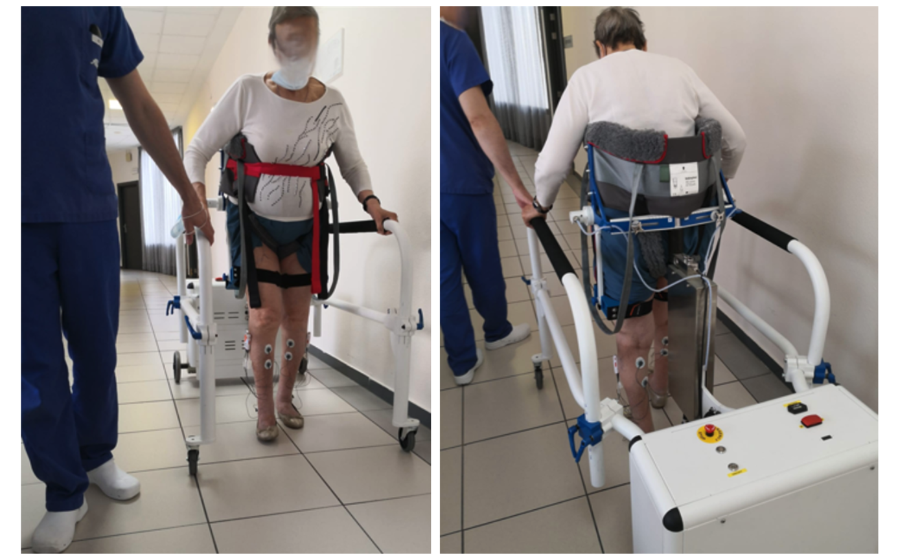
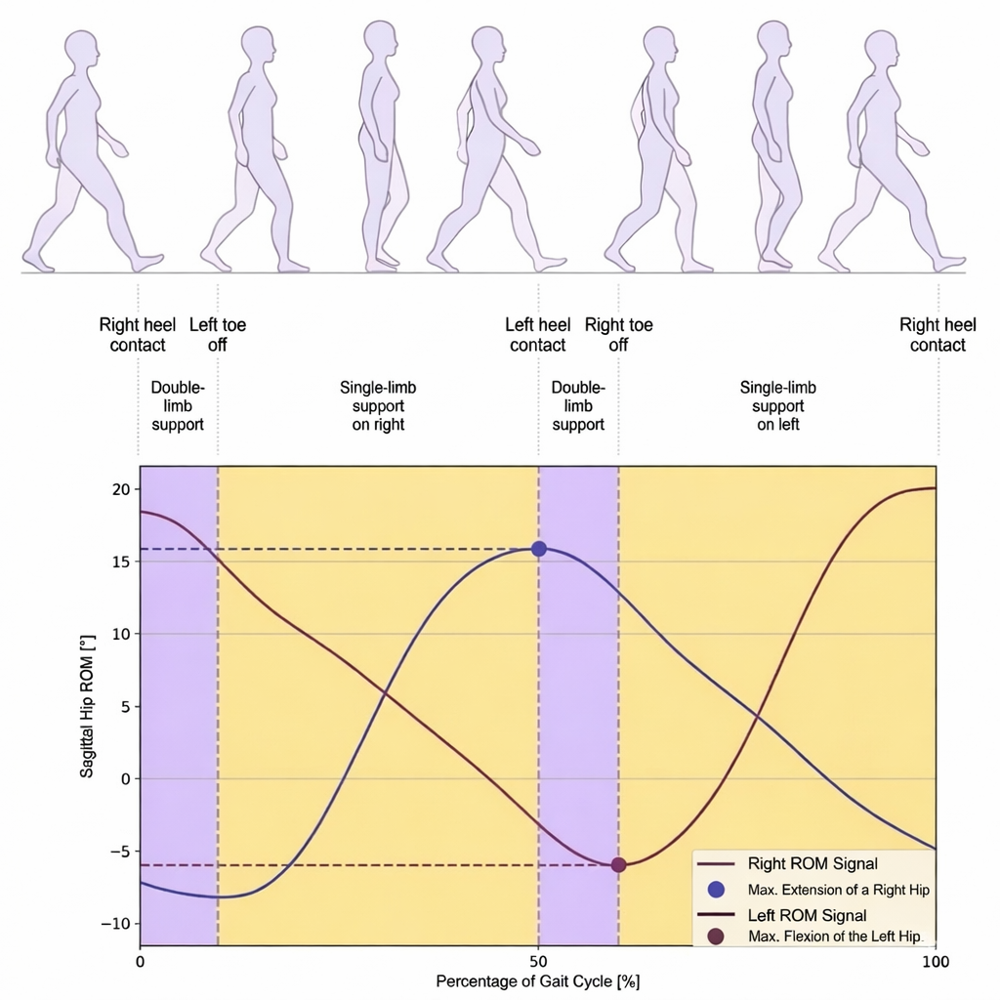
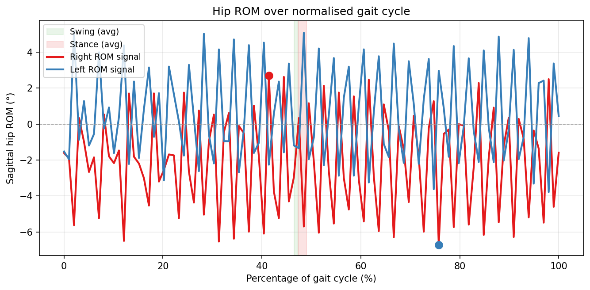
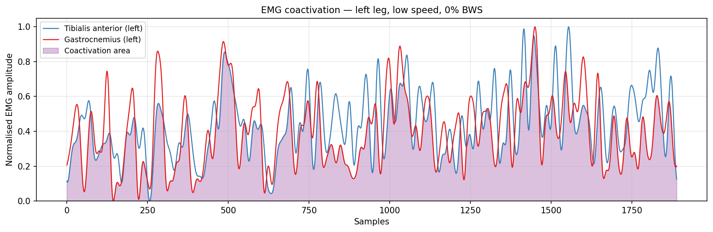
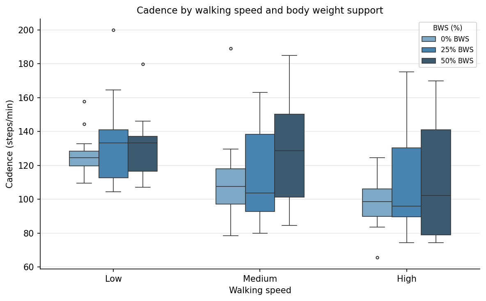
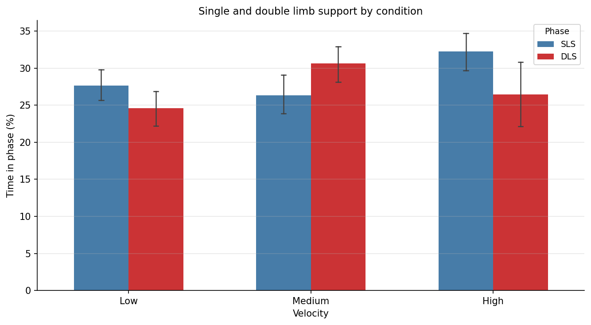
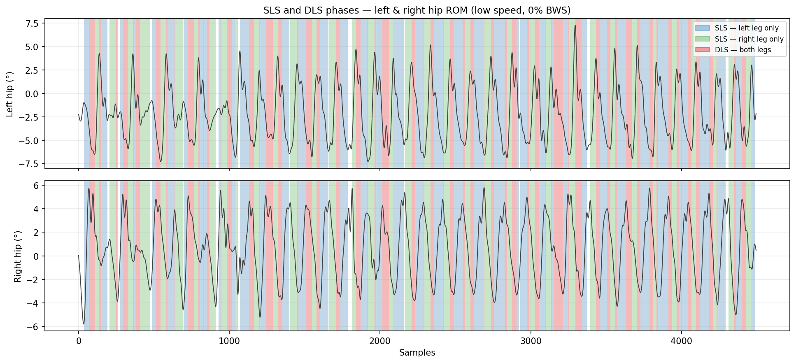
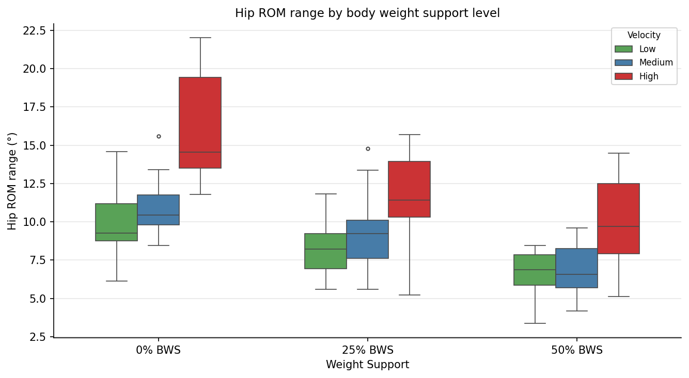
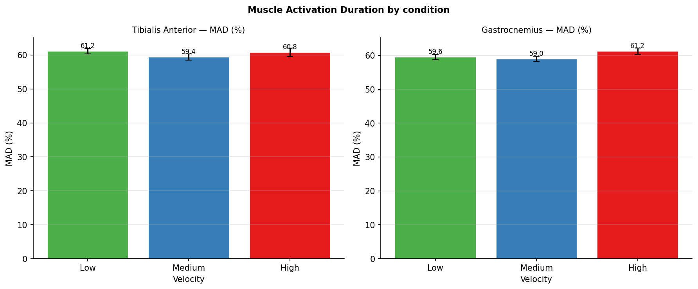
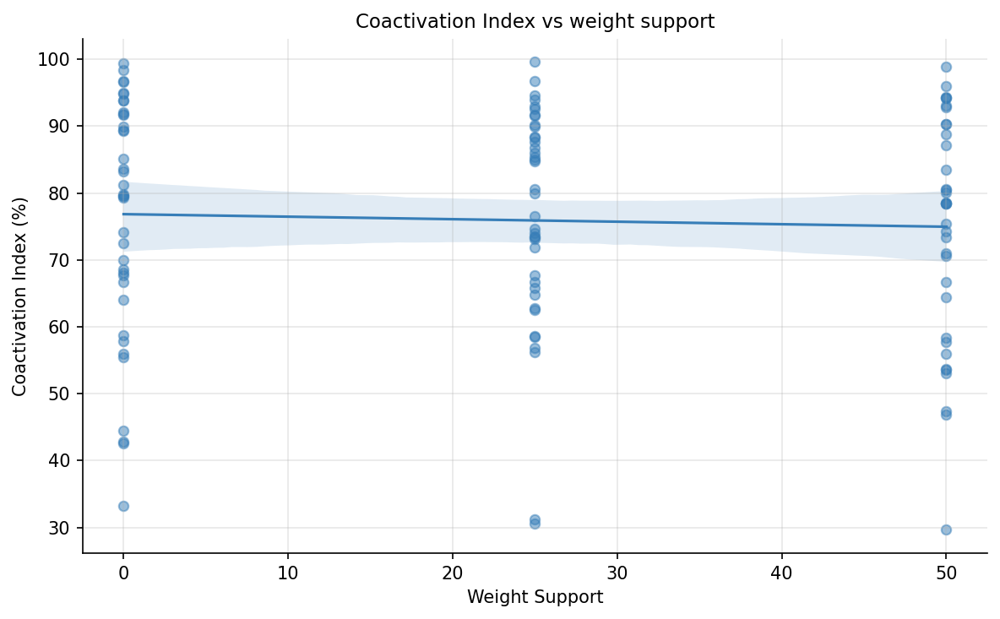

# Gait Analysis Pipeline — EMG & ROM from the SWalker Platform

Python pipeline for analysing surface EMG and hip range-of-motion (ROM) signals collected during overground gait trials with the **SWalker** robotic rehabilitation platform. Developed as part of a research study at the Hospital Nacional de Parapléjicos (Toledo) examining how walking speed and body weight support affect muscle activity and kinematics in older adults.

---

## Clinical context

The SWalker is an overground robotic walker that provides body weight support (BWS) via harness and drives gait at fixed speeds. Thirteen older adults (mean age 85.4 ± 6.8 years) walked at three speeds (low/medium/high) and three BWS levels (0 %, 25 %, 50 %), wearing wireless surface EMG sensors on tibialis anterior and gastrocnemius.



*Participant during a robotic-assisted gait trial using the SWalker overground platform.*

---

## What the pipeline measures

**EMG (tibialis anterior + gastrocnemius, both limbs):**
- RMS envelope
- MAD — Muscle Activation Duration (% of active time)
- CI — Coactivation Index between agonist and antagonist

**ROM (hip flexion/extension, both limbs):**
- Mean angle during swing phase
- Mean angle during stance phase
- Peak-to-peak ROM range

**Gait cycle:**
- Cadence (steps/min)
- Single Limb Support (SLS %)
- Double Limb Support (DLS %)
- Left–right symmetry index

---

## Gait cycle and ROM

Hip ROM in the sagittal plane is used to automatically segment each trial into swing and stance phases. Peaks and troughs in the filtered ROM signal correspond to gait events (heel contact, toe-off).



*Sagittal hip ROM over a normalized gait cycle (0–100 %). Maxima correspond to peak hip flexion at heel contact; minima to peak hip extension at terminal stance.*

---

## Pipeline

```
EMG CSV + ROM XLSX
       │
       ▼
1. Loading          data/loader.py            load_emg_files(), load_rom_files()
2. Validation       data/validator.py         validate_emg_dataframe(), validate_rom_dataframe()
3. EMG preprocess   preprocessing/emg.py      remove_outliers(), resample_emg()
4. ROM preprocess   preprocessing/rom.py      preprocess_rom()
       │                                        highpass → interpolate → trim → center
       ▼
5. Gait detection   analysis/gait_cycle.py    detect_peaks() → build_peak_sequence()
                                               → correct_peak_artifacts() → extract_phases()
6. EMG metrics      analysis/emg_metrics.py   compute_mad(), compute_coactivation_index()
7. ROM metrics      analysis/rom_metrics.py   compute_rom_mean_angle(), compute_rom_range()
8. Gait metrics     analysis/gait_metrics.py  compute_cadence(), compute_sls_dls()
       │
       ▼
   results DataFrame  (one row per trial)
       │
       ▼
9. Visualizations   visualization/            boxplots, bar charts, ROM phase overlays
```

---

## Results

Running the pipeline on the full dataset (13 participants × 3 speeds × 3 BWS levels = 112 trials) produces the following outputs.

### Gait cycle — hip ROM

Left and right hip ROM normalized to a single gait cycle (0–100 %). The shaded regions mark the average swing and stance phases detected from the ROM peaks. The dots mark peak hip flexion and peak extension within the cycle.



### EMG coactivation

Both muscle envelopes normalized to [0, 1]. The purple shaded area is the simultaneous activation of both muscles — the quantity that the Coactivation Index (CI) measures.



### Cadence by walking speed

Cadence increases progressively with the SWalker speed level, confirming that the pipeline correctly captures locomotor tempo. Higher BWS tends to slightly reduce cadence at low and medium speeds.



### Single and double limb support

SLS (one leg bearing weight) and DLS (both legs simultaneously in stance) quantify balance and gait stability. At low speed, DLS is higher — participants spend more time with both feet on the ground.



The phases can also be visualized directly on the raw ROM signal. Blue = left SLS, green = right SLS, red = DLS. The alternating pattern reflects normal reciprocal gait.



### Hip ROM by body weight support

Higher BWS reduces hip ROM, particularly at low speed. At 50 % unloading, ROM range drops ~30 % compared to unsupported walking.



### Muscle Activation Duration

Tibialis anterior MAD decreases with speed while gastrocnemius MAD increases — consistent with the shift from dorsiflexion control to push-off propulsion as speed rises.



### Coactivation Index vs body weight support

CI shows no strong trend with unloading level, suggesting that the balance between tibialis and gastrocnemius co-contraction is maintained regardless of BWS.



---

## Repository structure

```
gaitAnalysis/
├── gait_analysis/
│   ├── config.py                   # All constants: sampling rates, filter params, conditions
│   ├── schema.py                   # Column name constants
│   ├── pipeline.py                 # run_pipeline() — full orchestration
│   ├── data/
│   │   ├── loader.py               # load_emg_files(), load_rom_files(), parse_filename()
│   │   └── validator.py            # Shape and NaN checks
│   ├── preprocessing/
│   │   ├── emg.py                  # Outlier removal, upsampling, contraction detection
│   │   └── rom.py                  # Interpolation, Butterworth filter, trim, centering
│   ├── analysis/
│   │   ├── gait_cycle.py           # Peak detection, phase extraction
│   │   ├── emg_metrics.py          # MAD, CI, mean amplitude
│   │   ├── rom_metrics.py          # ROM amplitude per phase
│   │   └── gait_metrics.py         # Cadence, SLS/DLS, symmetry
│   └── visualization/
│       ├── emg_plots.py            # Raw EMG, binary contraction overlay
│       ├── rom_plots.py            # ROM with phase coloring, normalized gait cycle
│       └── stats_plots.py          # Boxplots, MAD bar charts (replaces R notebook)
│
├── tests/
│   └── test_metrics.py             # 32 unit tests for pure functions
│
├── notebooks/
│   └── analysis.ipynb              # Orchestration notebook
│
├── docs/images/
├── pyproject.toml
└── .pre-commit-config.yaml
```

---

## Installation

Requires **Python ≥ 3.10**.

```bash
git clone https://github.com/anchu09/gaitAnalysis.git
cd gaitAnalysis
uv sync
```

Or with pip:

```bash
pip install -e .
```

---

## Usage

### Run the full pipeline

```python
from pathlib import Path
from gait_analysis.pipeline import run_pipeline

results = run_pipeline(
    emg_dir=Path("data/EMG"),
    rom_dir=Path("data/ROM"),
    output_dir=Path("results"),   # saves results/results.csv
)
```

### Data layout

```
data/
├── EMG/
│   ├── PatientA_baja00.csv
│   ├── PatientA_medi25.csv
│   └── ...
└── ROM/
    ├── PatientA_baja00.xlsx
    ├── PatientA_medi25.xlsx
    └── ...
```

File naming: `<patient>_<velocity>_<weight_support>` where velocity ∈ `{baja, medi, alta}` and weight_support ∈ `{0, 25, 50}`.

### Run from the notebook

```bash
jupyter notebook notebooks/analysis.ipynb
```

---

## Tests

```bash
pytest tests/ -v
ruff check .
```

---

## Citation

> Sánchez-Herrera-Baeza P, et al. (2023). *Effects of Speed and Body Weight Support on Gait and Muscle Activity in Older Adults Using SWalker*. IEEE Transactions on Neural Systems and Rehabilitation Engineering.

---

## License

MIT
